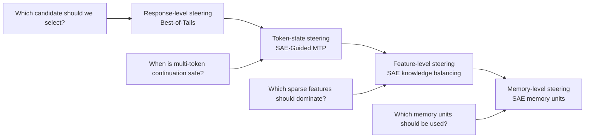

# Inference-Time Knowledge Steering

> **A research line on controlling model behavior at inference time: from reward-tail-aware response selection to sparse-feature signals for safe multi-token prediction and future memory-level steering.**

Modern language models already contain far more knowledge and capability than they reveal in any single answer. The practical question is no longer only how to train a better model, but how to control what the model uses when it responds.

At inference time, a model is not a static object. It samples, reasons, retrieves, self-evaluates, follows reward signals, and sometimes over-optimizes the wrong proxy. The same base model can produce a correct solution, a superficially convincing but wrong solution, or a safe but unhelpful refusal depending on how candidates are generated, scored, selected, accelerated, or internally steered.

This repository presents a line of research around one central question:

> **When a model has multiple possible ways to answer or continue generation, how do we decide which path is safe, useful, and worth spending compute on — without retraining the entire model?**

The current artifacts study this question at two complementary levels:

1. **Response-level steering** with **Best-of-Tails (BoT)**: when we sample multiple responses and score them with a proxy reward model, how optimistic or conservative should selection be?
2. **Token-level steering** with **SAE-Guided MTP**: when a model can extrapolate multiple future tokens, how can sparse internal features identify states where multi-token prediction is likely to be safe?

Together, these artifacts form the beginning of a broader agenda: **inference-time knowledge steering** — using inference compute not only to make models generate more, but to decide *which knowledge, features, and continuation paths should be trusted*.

---

## Why inference-time steering matters

Most alignment and adaptation methods modify model weights: supervised fine-tuning, RLHF, DPO, preference optimization, unlearning, or domain adaptation. These methods are powerful, but they are also expensive, slow to update, and hard to customize for every deployment context.

Inference-time steering offers a different path. Instead of permanently changing the model, we can change how it uses its existing capabilities at generation time.

A typical inference-time alignment pipeline is:

1. sample multiple candidate responses from a reference model;
2. score them with a proxy reward model;
3. select or reweight candidates according to the reward scores.

This pipeline turns additional inference compute into better answers. But it also creates a failure mode: if the proxy reward model is imperfect, sampling more candidates increases not only the chance of finding a genuinely better response, but also the chance of finding a response that exploits the proxy.

This is the first dilemma:

> **More inference compute gives the model more chances to be right — and more chances to hack the proxy.**

A second dilemma appears when we move from response selection to faster decoding. Multi-token prediction (MTP) can improve throughput by proposing several future tokens at once. But accepting multiple tokens is only safe when the current next-token state is sufficiently low-branching. If the model is at a point where many continuations are plausible, aggressive multi-token acceptance can amplify mistakes.

This gives a parallel question:

> **More speculative decoding can make the model faster — but only when the continuation is internally stable enough to extrapolate safely.**

Both dilemmas have the same structure. Inference-time compute is useful, but it needs a diagnostic signal. We need to know when to exploit, when to be conservative, and when a proxy or continuation path should be distrusted.

---

## Artifact I: Best-of-Tails Alignment

**Best-of-Tails: Bridging Optimism and Pessimism in Inference-Time Alignment** studies response-level steering through the lens of reward tails.

**Repository:** [HsiangHsu/Best-of-Tails](https://github.com/HsiangHsu/Best-of-Tails)  
**Paper:** [Best-of-Tails: Bridging Optimism and Pessimism in Inference-Time Alignment](https://arxiv.org/pdf/2603.06797)

The starting point is familiar. **Best-of-N (BoN)** is optimistic: it samples $N$ responses and selects the candidate with the highest proxy reward. This can work well when the reward model is calibrated and high proxy scores correspond to genuinely high-quality answers. But as $N$ grows, BoN increasingly depends on the extreme tail of the reward distribution, precisely where reward-model errors can be most severe.

Pessimistic or regularized methods reduce this risk by avoiding overly aggressive selection. But they can become too conservative: when genuinely good candidates are rare and the reward model is informative, pessimism may fail to use the extra inference compute.

BoT argues that neither optimism nor pessimism is universally correct. The right strategy depends on the **tail behavior of the proxy reward distribution for each prompt**.

---

## The key idea: reward-tail risk

For a fixed prompt, suppose we sample many candidate responses and score them with a proxy reward model. The top of this score distribution carries important information.

If the reward distribution is **light-tailed**, high-reward candidates are rare. In this regime, an aggressive selector can be useful: the model needs optimism to surface rare good responses.

If the reward distribution is **heavy-tailed**, many candidates receive very high proxy scores. This can indicate genuine abundance of good responses, but it can also signal reward-model miscalibration: the proxy may be assigning high scores too easily. In this regime, blindly taking the maximum becomes risky because the selected candidate may be an artifact of the reward model rather than a truly better answer.

BoT turns this observation into an adaptive selection rule:

> **Use optimism when the reward tail suggests rare valuable outliers; use pessimism when the reward tail suggests crowded, potentially miscalibrated extremes.**

The paper formalizes this trade-off with an inference-time regret bound that separates finite-sample approximation, proxy reward gain, reference-policy coverage, reward estimation error, and distortion from the reference policy. The analysis shows why reward-tail behavior changes the optimal selection strategy: light-tailed regimes favor more optimistic weighting, while heavy-tailed regimes call for more conservative weighting to avoid reward hacking.

---

## How BoT works

BoT has three conceptual steps.

### 1. Generate and score candidates

Given a prompt $x$, a reference policy samples a candidate set:

$$
Y_N = \{y_1, \ldots, y_N\} \sim \pi_{\mathrm{ref}}(\cdot \mid x).
$$

A proxy reward model assigns each candidate a normalized reward score $\hat r(x, y_i) \in [0,1]$.

### 2. Estimate the reward tail

BoT estimates how concentrated the top reward scores are near the endpoint. It uses a Hill-style estimator on the top order statistics of the reward scores. Intuitively, this asks:

> Are the best candidates clearly separated, or are many candidates crowded near the maximum?

The answer produces a prompt-specific tail estimate $\hat\kappa(x)$.

### 3. Adapt the selection rule

BoT maps the estimated tail heaviness to a Tsallis order:

$$
\alpha(x) = 1 + \frac{\hat\kappa(x)}{\hat\kappa(x) + \kappa_0}.
$$

This creates a continuum between two familiar regimes:

- as $\alpha \to 1$, BoT approaches exponential weighting, similar to soft Best-of-N and KL-regularized alignment;
- as $\alpha \to 2$, BoT approaches linear weighting, similar to pessimistic $\chi^2$-regularized selection.

Candidates are selected according to an adaptive Tsallis reweighting rule:

$$
\pi_{\mathrm{BoT}}(y \mid x) \propto
\pi_{\mathrm{ref}}(y \mid x)
\exp_{\alpha(x)}\left(\frac{\hat r(x,y)}{\lambda}\right).
$$

The result is a selector that changes its behavior prompt by prompt. It does not assume that one fixed level of optimism is always safe.

---

## Artifact II: SAE-Guided MTP

**SAE-Guided MTP: Sparse Features for Safe MTP State Detection** moves the research line from response-level selection to token-level continuation control.

**Repository:** [HsiangHsu/SAE-Guided-MTP](https://github.com/HsiangHsu/SAE-Guided-MTP)

Native multi-token prediction can improve decoding throughput by proposing multiple future tokens. But the key question is not whether a model can propose more tokens. The harder question is:

> **When is the model's current state stable enough that accepting multiple future tokens is safe?**

SAE-Guided MTP studies this question using sparse autoencoder features. The repo does **not** claim that SAEs make MTP possible, and it does **not** claim online decoding acceleration. Instead, it tests whether sparse internal features can detect **low-branching decoding states** — states where the next-token distribution is low-entropy or has a large top-1/top-2 margin, making multi-token extrapolation more likely to be safe.

This extends the same steering principle from BoT:

- BoT asks when high **reward** is trustworthy.
- SAE-Guided MTP asks when a multi-token **continuation** is trustworthy.

Both are inference-time trust problems.

---

## The key idea: low-branching states

At each decoding step, the model has a next-token distribution. Some states are **low-branching**: the model strongly prefers one continuation, and the next token is relatively stable. Other states are **high-branching**: many continuations remain plausible, and accepting multiple speculative tokens is riskier.

SAE-Guided MTP defines branching using target-model logits:

- low entropy or high top-1/top-2 margin → lower branching;
- high entropy or low top-1/top-2 margin → higher branching.

The central hypothesis is:

> **Sparse SAE features reveal when the model has entered a low-branching state where MTP is more likely to be safe.**

This is a mechanistic prerequisite for safer multi-token prediction. Before integrating with an online vLLM MTP gate, the repo first asks whether the signal exists at all.

---

## How SAE-Guided MTP works

The artifact has two stages.

### 1. Branching detector

The repo collects decoding states from `Qwen/Qwen3.5-27B` on 100 MBPP samples. For each state, it computes:

- next-token entropy;
- top-1/top-2 probability margin;
- hidden-state statistics;
- sparse SAE activations from Qwen-Scope SAEs.

It then trains simple logistic-regression detectors to classify low-branching versus high-branching states using several feature sets:

- text heuristics;
- hidden-state scalar statistics;
- SAE scalar aggregates;
- sparse SAE top-k feature IDs.

The main result is that **which sparse features fire** is much more predictive than surface text heuristics or aggregate hidden-state statistics.

### 2. Branching-gated MTP simulation

The repo then simulates an MTP gate:

- predicted low-branching → allow MTP;
- predicted high-branching → fall back to one-token decoding.

This is an **offline gating simulation**, not an online vLLM implementation. It evaluates whether SAE features provide a better safety-oriented gate than text or hidden-state baselines.

---

## SAE-Guided MTP results

### Branching detector

On the held-out test split, sparse SAE top-k features substantially outperform text and hidden-state baselines:

| Feature Set | ROC-AUC ↑ | PR-AUC ↑ | Balanced Acc ↑ |
|---|---:|---:|---:|
| Text heuristic | 0.630 | 0.659 | 0.601 |
| Hidden stats | 0.536 | 0.560 | 0.507 |
| SAE L0_50 scalar | 0.596 | 0.601 | 0.568 |
| SAE L0_50 all scalar | 0.620 | 0.620 | 0.590 |
| SAE L0_50 top-k | 0.857 | 0.853 | 0.786 |
| **SAE L0_50 top-k + scalar** | **0.869** | **0.867** | **0.779** |
| SAE L0_100 scalar | 0.590 | 0.609 | 0.544 |
| SAE L0_100 all scalar | 0.612 | 0.639 | 0.567 |
| SAE L0_100 top-k | 0.848 | 0.844 | 0.769 |
| **SAE L0_100 top-k + scalar** | **0.871** | **0.876** | **0.780** |

The main lesson is that aggregate activation statistics are not enough. The sparse feature identity — which SAE features fire — carries the useful signal.

### Branching-gated MTP simulation

The simulated gate shows that SAE features provide a better safety trade-off than text or hidden-state baselines:

| Method | MTP Allowed ↑ | Low-Branch Coverage ↑ | False-Safe Rate ↓ | Expected Accept Len ↑ | Safety Score ↑ |
|---|---:|---:|---:|---:|---:|
| Always one-token | 0.000 | 0.000 | 0.000 | 1.000 | 0.000 |
| Always MTP | 1.000 | 1.000 | 1.000 | 2.000 | 0.000 |
| Text-gated MTP | 0.715 | 0.790 | 0.632 | 1.715 | 0.157 |
| Hidden-gated MTP | 0.843 | 0.892 | 0.789 | 1.843 | 0.102 |
| **SAE L0_50-gated MTP** | **0.552** | **0.821** | **0.256** | **1.552** | **0.566** |
| SAE L0_100-gated MTP | 0.508 | 0.763 | 0.227 | 1.508 | 0.537 |

SAE L0_50 allows MTP on 55.2% of states, covers 82.1% of low-branch states, and reduces false-safe decisions to 25.6%. By contrast, the text-based gate has similar low-branch coverage but a much higher false-safe rate of 63.2%.

This supports the use of sparse features as a **safer gating signal** for MTP decisions. It does not yet establish online latency or pass@1 improvements.

---

## How the two artifacts connect

BoT and SAE-Guided MTP address different levels of the same inference-time steering problem.

| Level | Artifact | Trust question | Steering signal | Action |
|---|---|---|---|---|
| Response level | Best-of-Tails | When should high proxy reward be trusted? | Reward-tail shape | Optimistic vs pessimistic selection |
| Token level | SAE-Guided MTP | When is multi-token continuation safe? | Sparse low-branching features | Allow MTP vs fallback to one-token decoding |
| Feature level | SAE steering / knowledge balancing | Which internal knowledge source should dominate? | Sparse feature activations | Amplify, suppress, or route features |
| Memory level | SAE memory units | Which internal memory traces should be used? | Addressable memory-like features | Retrieve, inspect, combine, or edit memory units |

The shared thesis is that inference-time compute should be adaptive. We should not always select the maximum-reward response, and we should not always accept speculative tokens. Instead, we need local signals that indicate when a shortcut is trustworthy.

---

## From selection to control

BoT performs steering at the **response level**. It samples multiple candidate answers and uses reward-tail information to decide how aggressively to select among them.

SAE-Guided MTP performs steering at the **token-state level**. It uses sparse internal features to decide whether the current state is stable enough for multi-token extrapolation.

The next step is to move below response and token-level decisions toward **feature-level control**. Sparse autoencoders provide a possible interface: they expose sparse directions that may correspond to factual knowledge, contextual reliance, refusal behavior, reasoning patterns, or memorized associations.

The longer-term goal is to move from feature-level interventions to **explicit memory units**: modular representations of model knowledge that can be attributed, activated, suppressed, edited, or combined with context during inference.

The research arc is therefore:



---

## What this research line contributes

This line of work contributes a unified view of inference-time control:

1. **Reward-tail-aware response selection.**  
   BoT shows that reward-tail shape can diagnose when proxy reward should be exploited aggressively or treated conservatively.

2. **Sparse-feature safe-state detection.**  
   SAE-Guided MTP shows that sparse feature identities can identify low-branching states where multi-token continuation is more likely to be safe.

3. **A bridge between inference acceleration and interpretability.**  
   MTP is usually framed as a systems problem. SAE-Guided MTP reframes part of it as an interpretability problem: identify the internal states where acceleration is trustworthy.

4. **A path toward mechanistic knowledge routing.**  
   The same logic can extend to retrieval, long-context reasoning, refusal behavior, and memory-like feature control: use internal signals to decide which knowledge path should dominate.

---

## Future work I: Online SAE-gated MTP

The current SAE-Guided MTP artifact is an offline simulation. The next step is to integrate the gate into an online decoding system.

Important directions include:

- hook per-step SAE predictions into vLLM or another inference engine;
- expose native Qwen MTP proposal tokens, accepted lengths, and rollback statistics;
- replace the target-logit branching proxy with actual draft-token acceptance labels;
- evaluate whether SAE gating improves the throughput-quality trade-off in real decoding;
- test larger `num_speculative_tokens` and measure whether sparse gates remain conservative under higher-risk speculation budgets.

This would turn the current safe-state detector into an actual inference-time control mechanism.

---

## Future work II: SAE steering and knowledge balancing

A core problem in retrieval-augmented and long-context settings is that the model may overuse the wrong source of knowledge. Sometimes it should rely on the provided context. Sometimes it should trust its parametric knowledge. Sometimes both are needed, and the challenge is to balance them.

This motivates the question:

> **Can we estimate and control the mixture of parametric knowledge and contextual knowledge used during generation?**

SAEs offer a possible mechanism. If sparse features can identify whether an answer is driven by memorized knowledge or contextual evidence, then inference-time steering can become more mechanistic:

- estimate whether the answer is driven by context or parametric memory;
- suppress features associated with unsupported memorized claims;
- amplify features associated with context-grounded reasoning;
- steer the model away from context override or hallucinated recall.

This extends the line from **selecting among outputs** to **controlling the internal knowledge source that produces the output**.

---

## Future work III: SAE memorization and memory units

A more ambitious direction is to treat SAE features not only as interpretability tools, but as candidate memory units.

The guiding hypothesis is:

> **Some sparse features may function as addressable units of model memory.**

If this is true, then inference-time steering can become a form of memory routing. Instead of asking the model to use all of its parametric knowledge implicitly, we could identify which memory-like features are activated for a query, inspect whether they are relevant, and control their contribution to the next-token distribution.

This would create a bridge between mechanistic interpretability and retrieval-based systems:

- retrieval systems expose external documents;
- SAE memory units expose internal knowledge traces;
- inference-time steering decides how to combine both.

The long-term vision is a model that can answer not only with a generated response, but also with a structured account of which internal and external knowledge sources were used.

---

## What the artifacts contain

### Best-of-Tails

The BoT repo is a lightweight demonstration of reward-tail-aware response selection. It contains:

- implementations of BoN, soft BoN, ITP, and BoT selectors;
- a Hill-style tail estimator;
- a Tsallis weighting rule;
- frozen toy examples showing how selection changes under different proxy-score patterns;
- paper figures illustrating reward over-optimization and the optimism-pessimism trade-off.

### SAE-Guided MTP

The SAE-Guided MTP repo is a lightweight demonstration of sparse-feature safe-state detection. It contains:

- branching-trace collection on MBPP;
- Qwen-Scope SAE feature extraction;
- train/test-split low-branching detectors;
- text, hidden-stat, SAE-scalar, and SAE-top-k baselines;
- simulated MTP gating metrics;
- plots and GitHub-friendly summaries, with large per-state artifacts generated locally.

Both repos are intended as readable research artifacts rather than exhaustive benchmark suites.

---

## Unifying thesis

The central thesis of this research line is:

> **Inference-time compute should not only make models generate more. It should help us decide which signals to trust, which continuations to accept, and which internal knowledge paths should dominate.**

Best-of-Tails addresses this at the reward-selection level. SAE-Guided MTP addresses it at the token-state level. Future SAE steering and memory-unit work will address it at the level of internal knowledge representation.

This makes inference-time knowledge steering a natural complement to training-time alignment, machine unlearning, and mechanistic interpretability. Instead of permanently changing the model for every new requirement, we can build mechanisms that dynamically steer knowledge use at deployment time.

---

## Citation

```bibtex
@article{hsu2026bestoftails,
  title={Best-of-Tails: Bridging Optimism and Pessimism in Inference-Time Alignment},
  author={Hsu, Hsiang and Lei, Eric and Chen, Chun-Fu Richard},
  journal={arXiv preprint arXiv:2603.06797},
  year={2026}
}
```

---

## One-line summary

**Inference-Time Knowledge Steering studies how to decide which inference-time signals to trust, from reward-tail-aware response selection to sparse-feature detection of safe multi-token continuation states.**
