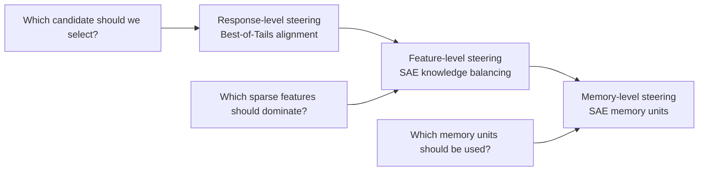

# Inference-Time Knowledge Steering

> **Steering which knowledge a model uses at inference time through reward-tail-aware selection, sparse feature interventions, and explicit memory-unit representations.**

Modern language models already contain far more knowledge than they reveal in any single answer. The practical question is no longer only how to train a better model, but how to control what the model uses when it is asked to respond.

At inference time, the model is not a static object. It samples, reasons, retrieves, self-evaluates, follows a reward signal, and sometimes over-optimizes the wrong proxy. The same base model can produce a correct solution, a superficially convincing but wrong solution, or a safe but unhelpful refusal depending on how candidates are generated, scored, selected, or internally steered.

This repository presents a research line around one central question:

> **When a model has multiple possible ways to answer, how do we steer it toward the right knowledge without retraining the entire model?**

The current artifact focuses on **Best-of-Tails (BoT)**, a method for reward-tail-aware inference-time alignment. The broader agenda extends this idea from response selection to sparse feature control and explicit memory-unit representations.

---

## Why inference-time steering matters

Most alignment and adaptation methods modify model weights: supervised fine-tuning, RLHF, DPO, preference optimization, unlearning, or domain adaptation. These methods are powerful, but they are also expensive, slow to update, and hard to customize for every deployment context.

Inference-time steering offers a different path. Instead of changing the model permanently, we can change how it uses its existing capabilities at the moment of generation. A typical inference-time alignment pipeline is simple:

1. sample multiple candidate responses from a reference model;
2. score them with a proxy reward model;
3. select or reweight candidates according to the reward scores.

This pipeline turns additional inference compute into better answers. But it also creates a new failure mode. If the reward model is imperfect, then sampling more candidates does not only increase the chance of finding a genuinely better response. It also increases the chance of finding a response that exploits the reward model.

This is the core dilemma:

> **More inference compute gives the model more chances to be right — and more chances to hack the proxy.**

A good inference-time steering method must therefore answer a more subtle question than “which candidate has the highest reward?” It must ask when high reward is trustworthy, when it is suspicious, and how aggressively the model should exploit it.

---

## The first artifact: Best-of-Tails Alignment

**Best-of-Tails: Bridging Optimism and Pessimism in Inference-Time Alignment** studies this dilemma through the lens of reward tails.

The paper starts from a familiar observation. **Best-of-N (BoN)** is optimistic: it samples $N$ responses and selects the candidate with the highest proxy reward. This can be effective when the reward model is calibrated and high proxy scores correspond to genuinely high-quality answers. But as $N$ grows, BoN increasingly depends on the extreme tail of the reward distribution, precisely where proxy reward errors can be most severe.

On the other side, pessimistic or regularized methods reduce the risk of reward hacking by avoiding overly aggressive selection. But they can become too conservative. If the reward model is informative and truly good candidates are rare, a pessimistic selector may fail to exploit the additional inference compute.

BoT argues that neither optimism nor pessimism is universally correct. The right strategy depends on the **tail behavior of the proxy reward distribution for each prompt**.

---

## The key idea: reward-tail risk

For a fixed prompt, suppose we sample many candidate responses and score them with a proxy reward model. The top of this score distribution carries important information.

If the reward distribution is **light-tailed**, high-reward candidates are rare. In this regime, an aggressive selector can be useful: the model needs optimism to surface rare good responses.

If the reward distribution is **heavy-tailed**, many candidates receive very high proxy scores. This can indicate genuine abundance of good responses, but it can also signal reward-model miscalibration: the proxy may be assigning high scores too easily. In this regime, blindly taking the maximum becomes risky because the selected candidate may be an artifact of the reward model rather than a truly better answer.

BoT turns this observation into an adaptive selection rule:

> **Use optimism when the reward tail suggests rare valuable outliers; use pessimism when the reward tail suggests crowded, potentially miscalibrated extremes.**

The paper formalizes this trade-off with an inference-time regret bound that separates finite-sample approximation, proxy reward gain, reference-policy coverage, reward estimation error, and distortion from the reference policy. The analysis shows why reward-tail behavior changes the optimal selection strategy. Light-tailed regimes favor more optimistic weighting, while heavy-tailed regimes call for more conservative weighting to avoid reward hacking. The paper then introduces BoT as a prompt-adaptive bridge between these regimes. fileciteturn5file0

---

## How BoT works

BoT has three conceptual steps.

### 1. Generate and score candidates

Given a prompt $x$, a reference policy samples a candidate set:

$$
Y_N = \{y_1, \ldots, y_N\} \sim \pi_{\mathrm{ref}}(\cdot \mid x).
$$

A proxy reward model assigns each candidate a normalized reward score $\hat r(x, y_i) \in [0,1]$.

### 2. Estimate the reward tail

BoT estimates how concentrated the top reward scores are near the endpoint. It uses a Hill-style estimator on the top order statistics of the reward scores. Intuitively, this asks:

> Are the best candidates clearly separated, or are many candidates crowded near the maximum?

The answer produces a prompt-specific tail estimate $\hat\kappa(x)$.

### 3. Adapt the selection rule

BoT maps the estimated tail heaviness to a Tsallis order:

$$
\alpha(x) = 1 + \frac{\hat\kappa(x)}{\hat\kappa(x) + \kappa_0}.
$$

This creates a continuum between two familiar regimes:

- as $\alpha \to 1$, BoT approaches exponential weighting, similar to soft Best-of-N and KL-regularized alignment;
- as $\alpha \to 2$, BoT approaches linear weighting, similar to pessimistic $\chi^2$-regularized selection.

Candidates are then selected according to an adaptive Tsallis reweighting rule:

$$
\pi_{\mathrm{BoT}}(y \mid x) \propto
\pi_{\mathrm{ref}}(y \mid x)
\exp_{\alpha(x)}\left(\frac{\hat r(x,y)}{\lambda}\right).
$$

The result is a selector that changes its behavior prompt by prompt. It does not assume that one fixed level of optimism is always safe.

---

## What the current GitHub artifact contains

The current code artifact is intentionally lightweight:

**Repository:** [HsiangHsu/Best-of-Tails](https://github.com/HsiangHsu/Best-of-Tails)  
**Paper:** [Best-of-Tails: Bridging Optimism and Pessimism in Inference-Time Alignment](https://arxiv.org/pdf/2603.06797)

The repo is a minimal demonstration of reward-tail-aware selection. It contains:

- a compact implementation of BoN, soft BoN, ITP, and BoT selectors;
- a Hill-style tail estimator;
- a Tsallis weighting rule;
- frozen toy examples showing how selection changes under different proxy-score patterns;
- paper figures illustrating reward over-optimization and the optimism-pessimism trade-off.

It does not aim to reproduce every large-scale paper experiment. Instead, it is designed as a clean GitHub artifact: a small, readable demo that communicates the central algorithmic idea in seconds.

---

## The breakthrough

The main breakthrough of BoT is not simply another selector. It is a shift in how inference-time alignment is diagnosed.

Standard Best-of-N treats high proxy reward as direct evidence of quality. Pessimistic methods treat high proxy reward as potentially dangerous. BoT asks a more local question:

> **What does the reward landscape for this prompt look like?**

This makes inference-time alignment adaptive rather than fixed. The same model and reward function can be used optimistically on one prompt and conservatively on another, depending on the observed reward-tail structure.

This matters because reward hacking is not uniformly distributed. Some prompts have clean reward landscapes where high-scoring candidates are genuinely better. Other prompts have crowded or heavy-tailed reward landscapes where the proxy is easier to exploit. BoT treats reward-tail shape as a signal for how much trust to place in the proxy.

---

## From alignment to knowledge steering

BoT is the first step in a broader research program: **inference-time knowledge steering**.

The common theme is that a language model contains multiple possible knowledge sources and reasoning paths. At inference time, we want to control which one dominates.

BoT performs this control at the **response level**. It samples multiple candidate answers and uses reward-tail information to decide how to select among them.

The next step is to move below responses and steer the model at the **feature level**. Sparse autoencoders (SAEs) provide a possible interface: they expose sparse, interpretable directions that may correspond to factual knowledge, contextual reliance, refusal behavior, reasoning patterns, or memorized associations.

The longer-term goal is to move from feature-level interventions to **explicit memory units**: modular representations of model knowledge that can be attributed, activated, suppressed, edited, or combined with context during inference.

The research arc is therefore:



---

## Future work I: SAE steering and knowledge balancing

The next artifact will study how to steer model behavior through sparse feature interventions rather than candidate selection alone.

A core problem in retrieval-augmented and long-context settings is that the model may overuse the wrong source of knowledge. Sometimes it should rely on the provided context. Sometimes it should trust its parametric knowledge. Sometimes both are needed, and the challenge is to balance them.

This motivates the question:

> **Can we estimate and control the mixture of parametric knowledge and contextual knowledge used during generation?**

SAEs offer a possible mechanism. If sparse features can identify when a model is relying on memorized knowledge versus contextual evidence, then inference-time steering can become more mechanistic:

- estimate whether the answer is driven by context or parametric memory;
- suppress features associated with unsupported memorized claims;
- amplify features associated with context-grounded reasoning;
- steer the model away from context override or hallucinated recall.

This would extend BoT from **selecting among outputs** to **controlling the internal knowledge source that produces the output**.

---

## Future work II: SAE memorization and memory units

A more ambitious direction is to treat SAE features not only as interpretability tools, but as candidate memory units.

The guiding hypothesis is:

> **Some sparse features may function as addressable units of model memory.**

If this is true, then inference-time steering can become a form of memory routing. Instead of asking the model to use all of its parametric knowledge implicitly, we could identify which memory-like features are activated for a query, inspect whether they are relevant, and control their contribution to the next-token distribution.

This would create a bridge between mechanistic interpretability and retrieval-based systems:

- retrieval systems expose external documents;
- SAE memory units expose internal knowledge traces;
- inference-time steering decides how to combine both.

The long-term vision is a model that can answer not only with a generated response, but also with a structured account of which internal and external knowledge sources were used.

---

## How the artifacts fit together

The full agenda has three stages.

### Stage 1 — Reward-tail-aware response selection

BoT asks how to select among candidate responses when a proxy reward model is useful but imperfect. It introduces reward-tail risk as a way to decide whether inference-time alignment should be optimistic or pessimistic for each prompt.

### Stage 2 — Sparse feature control

SAE steering asks how to intervene on the model’s internal computation so that the right knowledge source dominates: context when evidence is provided, parametric knowledge when appropriate, and refusal or safety mechanisms when necessary.

### Stage 3 — Explicit memory-unit inference

SAE memory units ask whether internal knowledge can be represented as modular, inspectable, and steerable components that participate in generation alongside retrieved context.

Together, these stages shift inference-time alignment from candidate selection toward knowledge control.

---

## Unifying thesis

The central thesis of this research line is:

> **Inference-time compute should not only make models think more. It should help us decide what knowledge they use, how strongly they use it, and when to distrust the mechanisms that select it.**

Best-of-Tails addresses this at the reward-selection level. SAE steering will address it at the feature-control level. Memory units aim to address it at the level of explicit knowledge representation.

This makes inference-time knowledge steering a natural complement to training-time alignment, machine unlearning, and interpretability. Instead of permanently changing the model for every new requirement, we can build mechanisms that dynamically steer knowledge use at deployment time.

---

## Suggested repository name

Recommended repo name:

```text
inference-time-knowledge-steering
```

Alternative names:

```text
knowledge-steering-at-inference
best-of-tails-and-knowledge-steering
reward-tail-knowledge-steering
```

I recommend **`inference-time-knowledge-steering`** because it is clear, formal, and directly matches the research theme on your website/CV.

---

## Citation

```bibtex
@article{hsu2026bestoftails,
  title={Best-of-Tails: Bridging Optimism and Pessimism in Inference-Time Alignment},
  author={Hsu, Hsiang and Lei, Eric and Chen, Chun-Fu Richard},
  journal={arXiv preprint arXiv:2603.06797},
  year={2026}
}
```

---

## One-line summary

**Inference-Time Knowledge Steering studies how to control which knowledge a model uses at deployment time, starting with reward-tail-aware response selection and extending toward sparse feature control and explicit memory-unit inference.**
