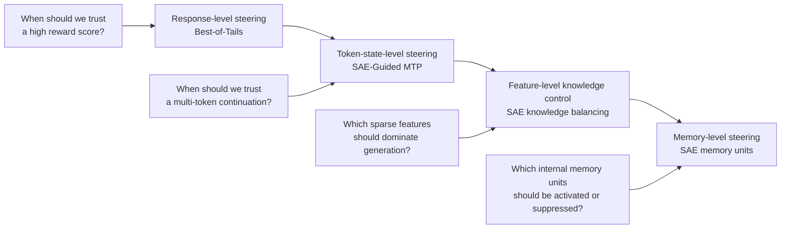
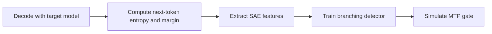

# Inference-Time Knowledge Steering

> **A research overview for steering model behavior at inference time: from reward-tail-aware response selection to sparse-feature signals for safer decoding and future memory-level control.**

Modern language models often contain the information needed to answer a question, but the answer they produce depends heavily on **how inference is controlled**: how candidates are sampled, how they are scored, how much compute is spent, which internal states are trusted, and when a proxy signal should be treated with caution.

This repository is an **overview and entry point** for a broader line of work:

> **How can we decide what to trust at inference time, without retraining the entire model?**

The individual artifacts live in separate repositories. This README explains how they fit together.

---

## Research roadmap



The first artifact studies **which response to select** when a reward model is useful but imperfect.  
The second artifact studies **which decoding states are safe for multi-token extrapolation** using sparse internal features.  
Future artifacts will move from selection and gating toward **direct sparse-feature steering** and **explicit memory-unit control**.

---

## Why inference-time knowledge steering?

Most adaptation and alignment methods modify model weights: supervised fine-tuning, RLHF, DPO, unlearning, preference optimization, or domain adaptation. These methods are powerful, but they are expensive to rerun, hard to customize for every deployment context, and difficult to update quickly.

Inference-time steering offers a complementary approach. Instead of permanently changing the model, we control **how the model uses its existing capabilities at generation time**.

This matters because additional inference compute creates both opportunity and risk:

> **More inference compute gives the model more chances to be right — and more chances to exploit the wrong signal.**

A useful inference-time system should therefore ask not only “what is the best-looking answer?” but also:

- When should we trust a high reward score?
- When is a multi-token continuation safe to accept?
- Which internal features indicate grounded reasoning, memorized recall, uncertainty, or proxy over-optimization?
- When should the system be optimistic, conservative, or fall back to a safer mode?

---

## Artifact I — Best-of-Tails: reward-tail-aware response selection

**Repository:** [HsiangHsu/Best-of-Tails](https://github.com/HsiangHsu/Best-of-Tails)  
**Paper:** [Best-of-Tails: Bridging Optimism and Pessimism in Inference-Time Alignment](https://arxiv.org/pdf/2603.06797)

### Question

> **When should we trust the highest-scoring response selected by a proxy reward model?**

Best-of-N and soft Best-of-N are optimistic: they sample multiple candidate responses and favor high proxy-reward outputs. This can improve quality when the reward model is calibrated, but it can also amplify reward hacking when the reward model assigns high scores too easily.

Best-of-Tails (BoT) studies this failure mode through **reward-tail risk**. The key observation is that the shape of the high-reward tail tells us something about how aggressively we should exploit the proxy reward.

- If high-reward candidates are rare and clearly separated, optimistic selection can be useful.
- If many candidates crowd near the reward maximum, the proxy may be easier to exploit, and conservative selection may be safer.

### Contribution

BoT introduces a prompt-adaptive selector that estimates the tail behavior of proxy rewards and maps it to a Tsallis-family reweighting rule. This creates a continuum between optimistic selection and pessimistic regularization.

At a high level:


The detailed algorithm, toy examples, and paper figures are in the BoT repository.

---

## Artifact II — SAE-Guided MTP: sparse features for safe multi-token continuation

**Repository:** [HsiangHsu/SAE-Guided-MTP](https://github.com/HsiangHsu/SAE-Guided-MTP)

### Question

> **When does the model’s current next-token state contain enough information to safely extrapolate multiple future tokens?**

Multi-token prediction and speculative decoding can speed up generation by proposing or accepting multiple tokens at once. But the core safety question is not merely whether multiple tokens can be proposed. It is whether the current decoding state is **low-branching** enough for those future tokens to be trusted.

SAE-Guided MTP studies this question using sparse autoencoder features. Instead of treating MTP as always safe or always risky, it asks whether sparse internal features can identify states where multi-token continuation is likely to be reliable.

### Contribution

This artifact moves the research line from **response-level selection** to **token-state-level gating**.

It tests whether Qwen-Scope SAE features can distinguish:

- **low-branching states**, where the next-token distribution is concentrated and multi-token continuation is more likely to be safe;
- **high-branching states**, where the next-token distribution is uncertain and aggressive continuation is riskier.

The repo implements a two-stage prototype:



The key takeaway is that **which sparse features fire** is a much stronger signal than simple text heuristics or hidden-state scalar statistics. The repo then uses this detector in an offline simulated MTP gate: predicted low-branching states allow MTP, while predicted high-branching states fall back to one-token decoding.

Detailed metrics, plots, generated artifacts, and limitations are documented in the SAE-Guided-MTP repository.

---

## How the artifacts connect

Both artifacts study the same high-level problem:

> **Inference-time compute is useful only if we know when to trust the signal that guides it.**

They differ in the level at which that trust decision is made.

| Level | Artifact | Trust question | Steering action |
|---|---|---|---|
| Response level | Best-of-Tails | Should we trust high proxy reward? | Select or reweight candidate responses |
| Token-state level | SAE-Guided MTP | Should we trust multi-token continuation? | Allow or block MTP in a decoding state |
| Feature level | Future SAE knowledge balancing | Which sparse features should dominate? | Amplify, suppress, or balance internal features |
| Memory level | Future SAE memory units | Which internal memory traces should be used? | Route, inspect, or edit memory-like features |

BoT and SAE-Guided MTP therefore represent two concrete steps toward the same agenda: **adaptive trust calibration at inference time**.

---

## Broader agenda: from selection to knowledge control

### Stage 1 — Reward-tail-aware response selection

BoT asks how to select among candidate responses when a proxy reward model is useful but imperfect. It introduces reward-tail risk as a prompt-level diagnostic for deciding when to be optimistic or conservative.

### Stage 2 — Sparse-feature signals for decoding control

SAE-Guided MTP asks whether internal sparse features can identify low-branching decoding states where multi-token continuation is safer. This shifts inference-time steering from whole-response selection to token-state gating.

### Stage 3 — Sparse feature control and knowledge balancing

The next step is to directly control internal sparse features during generation. A core problem in long-context and retrieval-augmented settings is deciding whether the model should rely on provided context, parametric memory, or a combination of both.

Future work will ask:

> **Can sparse features estimate and control the mixture of contextual and parametric knowledge used during generation?**

Possible directions include:

- identifying features associated with context-grounded reasoning;
- detecting unsupported memorized recall;
- suppressing features associated with hallucinated parametric knowledge;
- amplifying features associated with evidence-grounded computation.

### Stage 4 — Explicit memory-unit inference

A longer-term direction is to treat some sparse features as candidate **memory units**: modular internal representations that can be inspected, activated, suppressed, or combined with retrieved context.

This would connect mechanistic interpretability with retrieval-based systems:

- retrieval exposes external documents;
- SAE features expose internal knowledge traces;
- inference-time steering decides how to combine them.

---

## What this overview is — and is not

This repository is a **research-line interface**. It is intended to explain the conceptual connection among artifacts and point readers to the individual repos for implementation details and full results.

It is not meant to duplicate every experiment from each artifact. For details, use the dedicated repositories:

- [Best-of-Tails](https://github.com/HsiangHsu/Best-of-Tails): reward-tail-aware response selection;
- [SAE-Guided-MTP](https://github.com/HsiangHsu/SAE-Guided-MTP): sparse-feature detection of safe MTP states.

---

## Unifying thesis

> **Inference-time compute should not only make models think more. It should help us decide what signals to trust, what knowledge to use, and when to steer the model away from misleading shortcuts.**

Best-of-Tails addresses this at the reward-selection level.  
SAE-Guided MTP addresses this at the token-state gating level.  
Future work will extend it to sparse feature control and explicit memory-unit inference.

Together, these artifacts frame inference-time knowledge steering as a complement to training-time alignment, unlearning, and interpretability: instead of permanently changing the model for every new requirement, we can build mechanisms that dynamically control how its knowledge is used at deployment time.

---

## Suggested repository name

Recommended repo name:

```text
inference-time-knowledge-steering
```

Alternative names:

```text
knowledge-steering-at-inference
reward-tail-and-sparse-feature-steering
adaptive-inference-time-steering
```

I recommend **`inference-time-knowledge-steering`** because it is broad enough to cover both current artifacts and future work while remaining clear and formal.

---

## Citation

```bibtex
@article{hsu2026bestoftails,
  title={Best-of-Tails: Bridging Optimism and Pessimism in Inference-Time Alignment},
  author={Hsu, Hsiang and Lei, Eric and Chen, Chun-Fu Richard},
  journal={arXiv preprint arXiv:2603.06797},
  year={2026}
}
```

---

## One-line summary

**Inference-Time Knowledge Steering studies how to decide what to trust during generation, from reward-tail-aware response selection to sparse-feature signals for safer multi-token continuation and future memory-level control.**
